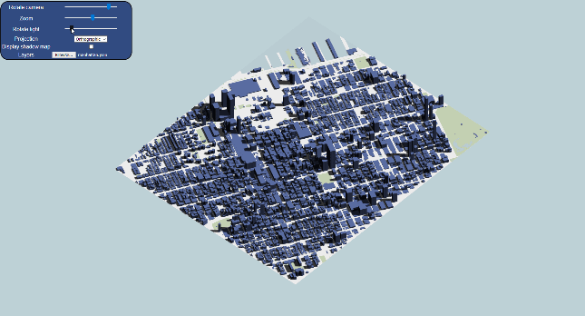

# Shadow Map WebGL

This project aims to implement shadow mapping techniques for urban settings using WebGL. By rendering shadows from directional light sources on 3D city models, we provide a tool for visualizing and analyzing shadow patterns in urban environments. The project incorporates multiple rendering techniques to showcase different aspects of shadow mapping, including perspective and orthographic projections, adjustable light directions, and optional advanced features.



- **Access this project:** https://komar41.github.io/shadow-maps-webgl/
- **GitHub repo:** https://github.com/komar41/shadow-maps-webgl/
- **Tools used:** WebGL, JavaScript, HTML, CSS

## How to run:
- Download the JSON file for [Manhattan](https://fmiranda.me/courses/cs425-spring-2021/manhattan.json.zip) or [Chicago](https://fmiranda.me/courses/cs425-spring-2021/chicago.json.zip).
- Unzip the downloaded file to extract the JSON.
- In the configuration panel, locate the file input option.
- Click on the file input and select the extracted JSON file (manhattan.json or chicago.json).

## Components

1. **3D Urban Model Rendering**
- Renders a 3D city model based on JSON file input
- Supports multiple layers: buildings, water, parks, and surface
- Uses unique buffer and VAO for each layer
- Implements normal-based shading for building sides

2. **Shadow Mapping**
- Implements shadow mapping technique for directional light
- Supports both perspective and orthographic projections
- Allows adjustable light direction

3. **Configuration Panel**
- Dropdown menu for projection type selection (perspective/orthographic)
- Slider for adjusting light direction (0-360 degrees)
- Checkbox for toggling shadow map texture display
- File input for loading JSON city models

4. **Camera Controls**
- Interactive camera rotation around the model's centerpoint
- Smooth transitions between different viewpoints

5. **Shadow Map Visualization**

- Renders the shadow map texture to screen when enabled

## Interaction Features
- Rotate camera view by moving the mouse around the canvas
- Adjust light direction using the slider
- Toggle between perspective and orthographic projections
- Upload custom city models in JSON format
- Optional: View raw shadow map texture

## Technical Details
- Implements multiple shader programs: ShadowMapProgram, RenderToScreenProgram, LayerProgram
- Uses Framebuffer Objects (FBO) for off-screen rendering
- Supports JSON file parsing for city model data
- Implements matrix operations for view, model, and projection transformations

## Data Format
The project uses a specific JSON format for city models, including:
- Coordinates, indices, and colors for buildings, water, parks, and surface layers
- Normal data for building layers

Example JSON structure:
```
{
    "buildings": {
        "coordinates": [...],
        "indices": [...],
        "normals": [...],
        "color": [r,g,b,a]
    },
    "water": {...},
    "parks": {...},
    "surface": {...}
}
```
